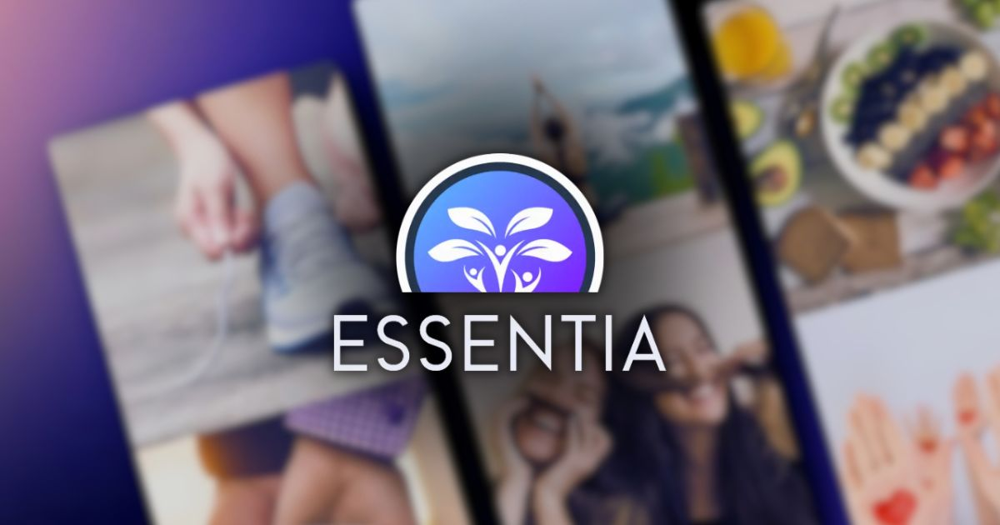

<a name="readme-top"></a>

<div align="center">

<a href="https://github.com/Ktumsh/essentia-web-oficial">
  
</a>

# 🌟 Web oficial de Essentia®

Essentia es una plataforma web que proporciona información y recursos sobre salud. Este proyecto tiene como objetivo ofrecer una experiencia personalizada y accesible para los usuarios interesados en mejorar su bienestar.\
[Reportar error](https://github.com/Ktumsh/essentia-web-oficial/issues) · [Sugerir algo](https://github.com/Ktumsh/essentia-web-oficial/issues)

</div>

<details>
<summary>Tabla de contenidos</summary>

- [🌟 Web oficial de Essentia](#-web-oficial-de-essentia)
- [✨ Características principales](#-características-principales)
  - [📸 Capturas de pantalla de Essentia](#-capturas-de-pantalla-de-la-web-de-essentia)
- [💡 Secciones Principales](#-secciones-principales)
- [🦾 Para empezar](#-para-empezar)
  - [📋 Prerequisitos](#-prerequisitos)
  - [🚀 Instalación](#-instalación)
- [🗂️ Estructura del Proyecto](#-contribuir-al-proyecto)
- [🤝 Contribuir al Proyecto](#-contribuir-al-proyecto)
- [🛠️ Tecnologías Utilizadas](#️-tecnologías-utilizadas)
- [📄 Licencia](#-licencia)
- [📧 Contacto](#-contacto)

</details>

## ✨ Características principales

- **Recursos esenciales**: Acceso a recursos esenciales sobre salud.
- **Últimas Noticias**: Muestra noticias relacionadas con la salud.
- **Recursos Destacados**: Acceso a recursos destacados como guías y recomendaciones.
- **Asistente de Salud**: Un asistente virtual para responder preguntas relacionadas con la salud.
- **Foro de la Comunidad**: Un espacio para que los usuarios discutan temas de salud.
- **Panel de Control Personal**: Herramientas y recursos personalizados para cada usuario.

### 📸 Capturas de pantalla de la web de Essentia


<p align="right">(<a href="#readme-top">volver arriba</a>)</p>

## 💡 Secciones Principales

1. **Recursos**
   - 🧘‍♀️ Salud y Bienestar
   - 🏋️ Ejercicios y Fitness
   - 🍎 Nutrición
   - 🧠 Bienestar Emocional
   - 👫 Salud y Educación Sexual
   - 👨‍👩‍👧‍👦 Salud para Todas las Edades

2. **📰 Noticias**: Sección para mostrar noticias relacionadas con la salud.

3. **🤖 Essentia AI**: Inteligencia artificial especializada en salud.

4. **📚 Recursos Adicionales**: Sección para recursos adicionales sobre salud.

5. **🌐 Comunidad**: Apartado para la comunidad de usuarios.

## 🦾 Para empezar

### 📋 Prerequisitos

- PNPM (es nuestra recomendación por su eficiencia y rapidez)

  ```sh
  npm install -g pnpm
  ```

- o NPM

  ```sh
  npm install npm@latest -g
  ```

### 🚀 Instalación

1. Clona el repositorio

   ```sh
   git clone https://github.com/Ktumsh/essentia-web-oficial.git
   ```

2. Instala los paquetes de NPM

   ```sh
   pnpm install
   ```

3. Ejecuta el proyecto

   ```sh
   pnpm run dev
   ```
   
4. Autenticación con google, facebook o twitter (opcional)
   - Para google accede a la [consola de google](https://console.cloud.google.com/), crea una app y obtén tu client id y client secret
   - Para facebook accede a la [consola de facebook/meta](https://developers.facebook.com/), crea una app y obtén tu app id y app secret
   - Para Twitter accede a la [consola de twitter](https://developer.twitter.com/), crea una app y obtén tu client id y client secret
   - Genera un hash aleatorio, puedes usar el siguiente comando ```openssl rand -hex 32``` o en [esta página](https://generate-secret.vercel.app/)
   - Crea un archivo llamado ```.env.local``` y copia el contenido de [.env.demo](.env.demo) en él
   - Reemplaza el texto copiado de demo en ```.env.local``` con tu id, secreto y hash

<p align="right">(<a href="#readme-top">volver arriba</a>)</p>

## 🗂️ Estructura del Proyecto

```text
essentia-web-oficial/
│
├── public/ # Archivos estáticos
├── src/ # Código fuente del proyecto
│ ├── components/ # Componentes reutilizables
│ ├── consts/ # Constantes utilizadas en el proyecto
│ ├── icons/ # Iconos utilizados en la interfaz
│ ├── layouts/ # Layouts del proyecto
│ ├── lib/ # Librerías y módulos personalizados
│ ├── pages/ # Páginas del sitio
│ ├── sections/ # Secciones reutilizables del sitio
│ ├── types/ # Definiciones de tipos TypeScript
│ ├── utils/ # Utilidades y funciones auxiliares
│ └── env.d.ts # Definiciones de tipos para variables de entorno
│
├── astro.config.mjs # Configuración de Astro
├── auth.config.mjs # Configuración de autenticación
├── auth.d.ts # Definiciones de tipos para autenticación
├── svelte.config.js # Configuración de Svelte
├── tailwind.config.mjs # Configuración de Tailwind CSS
└── tsconfig.json # Configuración de TypeScript
```

<p align="right">(<a href="#readme-top">volver arriba</a>)</p>

## 🤝 Contribuir al Proyecto

¡Las contribuciones son bienvenidas! Para contribuir, sigue estos pasos:

Si tienes alguna sugerencia que podría mejorar el proyecto, por favor haz un [_fork_](https://github.com/Ktumsh/essentia-web-oficial/fork) del repositorio y crea una [_pull request_](https://github.com/Ktumsh/essentia-web-oficial/pulls). También puedes simplemente abrir un [_issue_](https://github.com/Ktumsh/essentia-web-oficial/issues) con la etiqueta "enhancement".

Aquí tienes una guía rápida:

1. Haz un [_fork_](https://github.com/Ktumsh/essentia-web-oficial/fork) del Proyecto
2. Clona tu [_fork_](https://github.com/Ktumsh/essentia-web-oficial/fork) (`git clone <URL del fork>`)
3. Añade el repositorio original como remoto (`git remote add upstream <URL del repositorio original>`)
4. Crea tu Rama de Funcionalidad (`git switch -c feature/nueva-caracteristica`)
5. Realiza tus Cambios (`git commit -m 'Add: alguna caracteristica'`)
6. Haz Push a la Rama (`git push origin feature/nueva-caracteristica`)
7. Abre una [_pull request_](https://github.com/Ktumsh/essentia-web-oficial/pulls)

<p align="right">(<a href="#readme-top">volver arriba</a>)</p>

## 🛠️ Tecnologías Utilizadas

- [![Astro][astro-badge]][astro-url] - Framework para sitios web basados ​​en contenido.
- [![React JSX][react-badge]][react-url] - Biblioteca para interfaces de usuario web y nativas.
- [![Typescript][typescript-badge]][typescript-url] - JavaScript con sintaxis para tipos.
- [![Svelte][svelte-badge]][svelte-url] - Framework para construir interfaces de usuario de manera más eficiente.
- [![Tailwind CSS][tailwind-badge]][tailwind-url] - Un marco de utilidad CSS para crear rápidamente diseños personalizados.

## 📄 Licencia

Este proyecto está licenciado bajo la Licencia [Creative Commons Attribution-NonCommercial-ShareAlike 4.0 International License](http://creativecommons.org/licenses/by-nc-sa/4.0/). Consulta el archivo [LICENSE](LICENSE.md) para más detalles.

## 📧 Contacto

Para más información o preguntas, puedes contactarme en [jo.barrazav@gmail.com](mailto:jo.barrazav@gmail.com).

---

¡Gracias por utilizar Essentia! Esperamos que encuentres útil nuestra plataforma para mejorar tu salud y bienestar.

<p align="right">(<a href="#readme-top">volver arriba</a>)</p>

[astro-url]: https://astro.build/
[react-url]: https://es.react.dev/
[typescript-url]: https://www.typescriptlang.org/
[svelte-url]: https://svelte.dev/
[tailwind-url]: https://tailwindcss.com/
[astro-badge]: https://img.shields.io/badge/Astro-fff?style=for-the-badge&logo=astro&logoColor=bd303a&color=352563
[react-badge]: https://shields.io/badge/react-black?logo=react&style=for-the-badge
[typescript-badge]: https://img.shields.io/badge/Typescript-007ACC?style=for-the-badge&logo=typescript&logoColor=white&color=blue
[svelte-badge]: https://img.shields.io/badge/Svelte-4A4A55?style=for-the-badge&logo=svelte
[tailwind-badge]: https://img.shields.io/badge/Tailwind-ffffff?style=for-the-badge&logo=tailwindcss&logoColor=38bdf8
