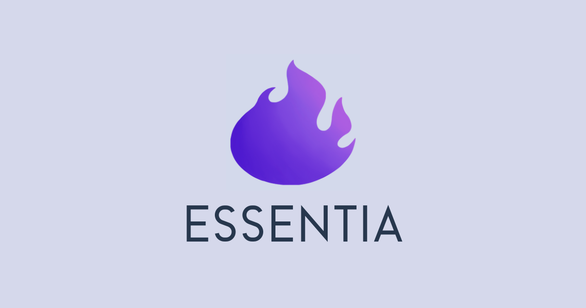

<div align="center">

<a href="https://github.com/Ktumsh/essentia">
  
</a>

# 🌟 Desarrollo Oficial de Essentia Web

Essentia es una plataforma web diseñada para ofrecer información y recursos completos sobre salud. Su principal objetivo es motivar a las personas a cuidar de su bienestar y aprender más sobre la salud de si mismas y de sus seres queridos. La plataforma busca centralizar el conocimiento sobre salud en un solo lugar, brindando a los usuarios acceso a una amplia gama de recursos que promuevan un estilo de vida saludable e informado.\
[Reportar error](https://github.com/Ktumsh/essentia-web-oficial/issues) · [Sugerir algo](https://github.com/Ktumsh/essentia-web-oficial/issues)

</div>

<details>
<summary>Tabla de contenidos</summary>

- [🌟 Desarrollo Oficial de Essentia Web](#-desarrollo-oficial-de-essentia-web)
- [✨ Características principales](#-características-principales)
- [💡 Secciones Principales](#-secciones-principales)
- [📋 Prerequisitos](#-prerequisitos)
- [🚀 Instalación](#-instalación)
- [🗂️ Estructura del Proyecto](#-contribuir-al-proyecto)
- [🛠️ Tecnologías Utilizadas](#️-tecnologías-utilizadas)
- [📄 Licencia](#-licencia)
- [📧 Contacto](#-contacto)

</details>

## ✨ Características principales

- **Recursos esenciales**: Acceso a recursos esenciales sobre salud.
- **Recursos Destacados**: Acceso a recursos destacados como guías y recomendaciones.
- **Asistente de Salud**: Un asistente virtual para responder preguntas relacionadas con la salud.
- **Buscador de Centros de Salud Cercanos**: Un buscador de estilo Google Maps pero para centros de salud.
- **Panel de Control Personal**: Herramientas y recursos personalizados para cada usuario.

## 💡 Secciones Principales

1. **Recursos**

   - 🧘‍♀️ Salud y Bienestar
   - 🏋️ Ejercicios y Fitness
   - 🍎 Nutrición
   - 🧠 Bienestar Emocional
   - 👫 Salud y Educación Sexual
   - 👨‍👩‍👧‍👦 Salud en Todas las Edades

2. **🤖 Essentia AI**: Inteligencia artificial especializada en salud.

3. **🌐 Centros de Salud**: Apartado de búsqueda de centros de salud y farmacias cercanas.

4. **📚 Recursos Adicionales**: Sección para recursos adicionales sobre salud.

### 📋 Prerequisitos

- PNPM (recomendación por su eficiencia y rapidez)

  ```sh
  npm install -g pnpm
  ```

- o NPM

  ```sh
  npm install npm@latest -g
  ```

### 🚀 Instalación

1. Clona el repositorio

   ```sh
   git clone https://github.com/Ktumsh/essentia.git
   ```

2. Instala los paquetes de NPM

   ```sh
   pnpm install
   ```

3. Ejecuta el proyecto

   ```sh
   pnpm run dev
   ```

4. Configura las variables de entorno necesarias para tu desarrollo local
   - Crea un archivo llamado `.env.local` y copia el contenido de [.env.demo](.env.demo) en él.
   - Reemplaza el texto copiado de demo en `.env.local` con los datos requeridos.
   - Contacta con el propietario para obtener la información.

## 🗂️ Estructura del Proyecto

- Este proyecto sigue la filosofía de **Screaming Architecture**.
- En lugar de indicar **qué usamos**, nuestras carpetas indican **qué hacemos**.
- El dominio del negocio es el núcleo y está reflejado directamente en la estructura del proyecto.
- Cada módulo representa una funcionalidad clave del sistema, facilitando el mantenimiento y la escalabilidad.

```text
├── /modules/                      # Módulos principales de la aplicación
│   ├── /additionals/              # Módulo de Recursos Adicionales
│   │   ├── /components/           # components UI adicionales
│   │   ├── /hooks/                # Hooks reutilizables para recursos adicionales
│   │   └── /lib/                  # Lógica y utilidades de recursos adicionales
│   ├── /auth/                     # Módulo de Autenticación
│   │   ├── /components/           # components UI para autenticación
│   │   ├── /hooks/                # Hooks específicos para autenticación
│   │   └── /lib/                  # Lógica relacionada con la autenticación
│   ├── /chatbot/                  # Módulo de Chatbot/Essentia AI
│   │   ├── /chat/                 # Funcionalidades del chat del chatbot
│   │   ├── /components/          # components de UI del chatbot
│   │   ├── /hooks/                # Hooks reutilizables para el chatbot
│   │   └── /lib/                  # Lógica y utilidades del chatbot
│   ├── /core/                     # Núcleo de la aplicación
│   │   ├── /components/           # components UI principales
│   │   ├── /hooks/                # Hooks reutilizables globales
│   │   └── /lib/                  # Lógica central compartida
│   ├── /health-centers/           # Módulo de Centros de Salud
│   │   ├── /components/           # components UI relacionados con centros de salud
│   │   ├── /hooks/                # Hooks específicos para centros de salud
│   │   └── /lib/                  # Lógica y utilidades relacionadas con centros de salud
│   ├── /home/                     # Módulo página de inicio
│   ├── /icons/                    # Íconos usados en la aplicación
│   ├── /about/                    # Módulo de Acerca de
│   ├── /news/                     # Módulo de Noticias
│   ├── /notfound/                 # Módulo de error 404
│   ├── /profile/                  # Módulo de Perfil de Usuario
│   └── /resources/                # Módulo de Recursos Principales
```

## 🛠️ Tecnologías Utilizadas

- [![Next.js][nextjs-badge]][nextjs-url] Framework de React para aplicaciones web con renderizado del lado del servidor y generación estática (versión 14).
- [![Typescript][typescript-badge]][typescript-url] JavaScript con sintaxis para tipos.
- [![Tailwind CSS][tailwind-badge]][tailwind-url] Un marco de utilidad CSS para crear rápidamente diseños personalizados.

## 📄 Licencia

Este proyecto está licenciado bajo la **[Licencia Creative Commons Attribution-NonCommercial-NoDerivatives 4.0 International License](http://creativecommons.org/licenses/by-nc-nd/4.0/)**. Consulta el archivo [LICENSE](LICENSE.md) para más detalles.

## 📧 Contacto

Para más información o preguntas, puedes contactar al propietario en [jo.barrazav@gmail.com](mailto:jo.barrazav@gmail.com).

---

¡Gracias por utilizar Essentia!

[nextjs-url]: https://nextjs.org/
[typescript-url]: https://www.typescriptlang.org/
[tailwind-url]: https://tailwindcss.com/
[nextjs-badge]: https://img.shields.io/badge/Next.js-000000?style=for-the-badge&logo=nextdotjs&logoColor=white
[typescript-badge]: https://img.shields.io/badge/Typescript-007ACC?style=for-the-badge&logo=typescript&logoColor=white&color=blue
[tailwind-badge]: https://img.shields.io/badge/Tailwind-ffffff?style=for-the-badge&logo=tailwindcss&logoColor=38bdf8
